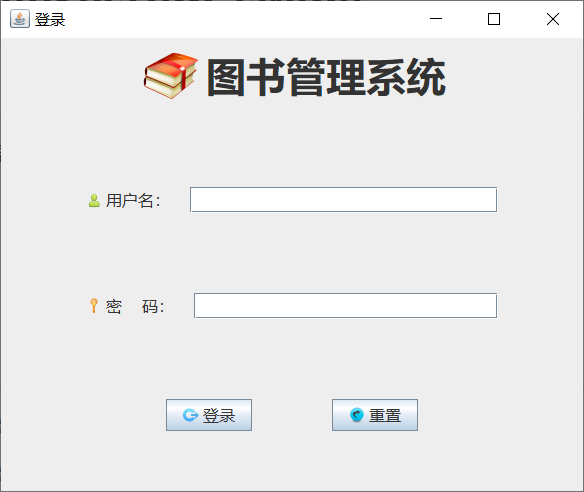
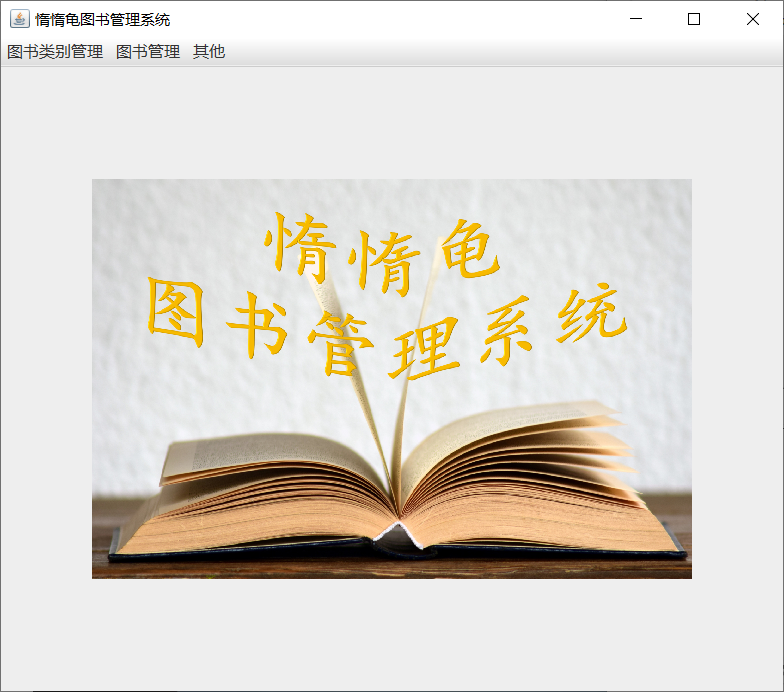
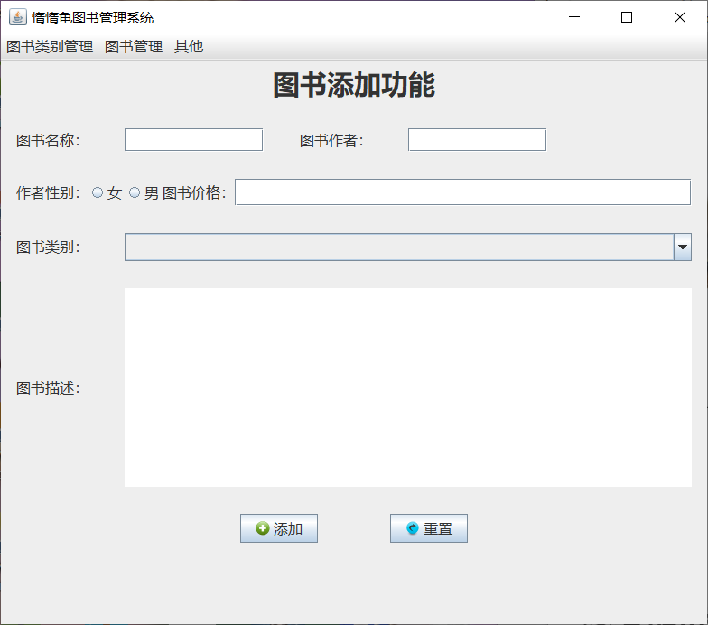
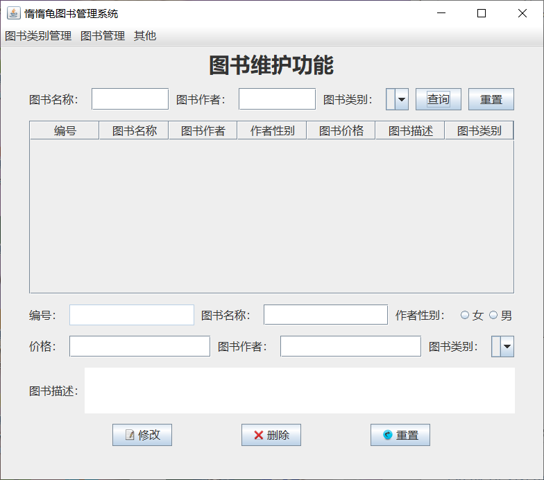
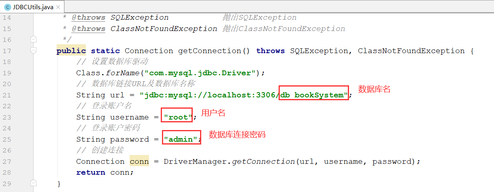

[toc]

# BookManageSystem_swing

## 项目介绍

图书管理系统，通过swing展示数据。

运行截图如下：

- 登录页面

登录账户，这里没有调用数据库，而是使用默认唯一账户：（**用户名：张三；密码：123456**）。

- 主界面

- 图书添加

- 图书维护

## 使用指导

第一步：修改数据库连接参数在JDBCUtils.java中的getConnection()方法中

第二步：运行Main.java类的main()方法。

第三步：登录账户，这里没有调用数据库，而是使用默认唯一账户：（**用户名：张三；密码：123456**）。

## 目录说明

- file

该目录下有两个文件，其中是一个连接MySQL数据库所需要的jar包，另一个是项目所使用的数据库表SQL，需要先创建名为db_booksystem的数据库，再在其下执行该db_booksystem.sql中的语句。

- images

该目录下存放的是README.md文件中所需要用到的图片资源。

- src

该目录下是本项目的源代码。

## 参考链接

[Java实战之图书管理系统（swing版）（1）——项目简述](http://mp.weixin.qq.com/s?__biz=MzU4MDc0NDI0NQ==&mid=2247484509&idx=1&sn=81703225726d5142c9a2039e63df4642&chksm=fd536107ca24e811f1543a831988cbf3589ee90a80cef36be192fcd3e3d083c0d356cf771d22&scene=21#wechat_redirect)

[Java实战之图书管理系统（swing版）（2）——功能介绍](http://mp.weixin.qq.com/s?__biz=MzU4MDc0NDI0NQ==&mid=2247484510&idx=1&sn=0d384310a49f8187b52022fba417b294&chksm=fd536104ca24e812d08f5b792640f8058a0b078cbf66a8698fbc4b041c6e8cbfef287aad8d78&scene=21#wechat_redirect)

[Java实战之图书管理系统（swing版）（10）——数据库表](http://mp.weixin.qq.com/s?__biz=MzU4MDc0NDI0NQ==&mid=2247484511&idx=1&sn=053e92eae71736b642a44120069bcc27&chksm=fd536105ca24e81386bb0ac5255f1c60b090e023157275a7cccbbeea2b00470deff685f80a5e&scene=21#wechat_redirect)

[Java实战之图书管理系统（swing版）（3）——登录界面及功能实现](http://mp.weixin.qq.com/s?__biz=MzU4MDc0NDI0NQ==&mid=2247484512&idx=1&sn=5d8d9006fd7943e8407769dae5c42bb2&chksm=fd53613aca24e82c32944c3dd5f49cbea13b89f65a00b58d1e2d38f76fbe01178089c542e78a&scene=21#wechat_redirect)

[Java实战之图书管理系统（swing版）（4）——主界面及功能实现](http://mp.weixin.qq.com/s?__biz=MzU4MDc0NDI0NQ==&mid=2247484513&idx=1&sn=ed3764f66b67335d5e619fc18df611a6&chksm=fd53613bca24e82dc9bde594abe1e53fe8a25815156df95e1a12ba86a50480e8a1edd3b31592&scene=21#wechat_redirect)

[Java实战之图书管理系统（swing版）（5）——图书类别添加界面及功能实现](http://mp.weixin.qq.com/s?__biz=MzU4MDc0NDI0NQ==&mid=2247484514&idx=1&sn=074eba2d803105f341322fd79ce7ccaf&chksm=fd536138ca24e82ea81f145fbd0d8b0148cb3bbc1b73c900b9a9eef6ea7f802dac9bdabd962f&scene=21#wechat_redirect)

[Java实战之图书管理系统（swing版）（6）——图书类别维护界面及功能实现](http://mp.weixin.qq.com/s?__biz=MzU4MDc0NDI0NQ==&mid=2247484515&idx=1&sn=6dbbdcb1251b8fcbcaf715c1b70f577e&chksm=fd536139ca24e82f2810c5c578d84bbf8c5121fb7d99bc54be7b98f6be8e9b95ffbda4abd4e7&scene=21#wechat_redirect)

[Java实战之图书管理系统（swing版）（7）——图书添加界面及功能实现](http://mp.weixin.qq.com/s?__biz=MzU4MDc0NDI0NQ==&mid=2247484588&idx=1&sn=04fe6ddd4a7ad94a31edb234d07034b6&chksm=fd5361f6ca24e8e05b0c3e50c61801c69934cf120674603bfb679aab6b56387df2b7df7ee2cb&scene=21#wechat_redirect)

[Java实战之图书管理系统（swing版）（8）——图书维护界面及功能实现](http://mp.weixin.qq.com/s?__biz=MzU4MDc0NDI0NQ==&mid=2247484589&idx=1&sn=f97d1eabe2b7df0280772dce47e8040e&chksm=fd5361f7ca24e8e1f111aade15cc47cb83b0454ccd9a1615c95533b1e3413480ee53ed22ffdf&scene=21#wechat_redirect)

[Java实战之图书管理系统（swing版）（9）——其他界面及功能实现](http://mp.weixin.qq.com/s?__biz=MzU4MDc0NDI0NQ==&mid=2247484590&idx=1&sn=584c94877ec8ff04484fede643de6164&chksm=fd5361f4ca24e8e266f6ec6ddf1c29f7dee3165d3f8ab667d034390bfa715eeef8d0f469e06c&scene=21#wechat_redirect)